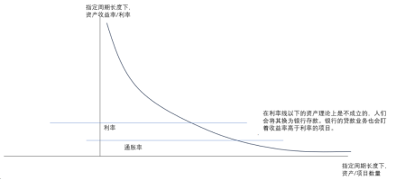
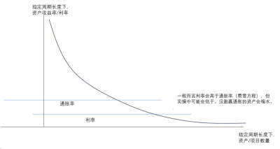
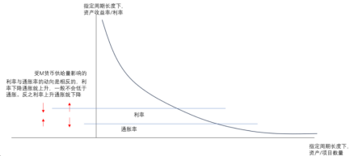
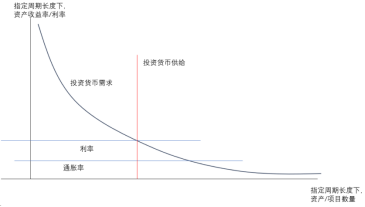
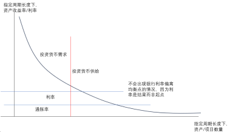
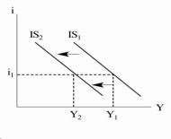
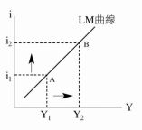
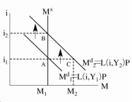
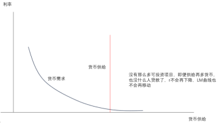
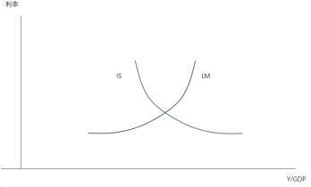

# 美联储最新动向研究

## 基础知识

### IS-LM模型
短期分析模型，但也没有那么短，时间尺度在几年左右。

搭建要素与产品市场、货币市场间的均衡桥梁。要素与产品市场、货币市场之间的交互影响的桥梁在利率与产出，为什么呢？因为在短期，r能够有较大变化空间、Y也能有较大变化空间。其他的指标如P物价被认为是粘性的（在长期模型中会成为桥梁）。总之，要连接不同市场来做均衡分析，就得找特定的共同变量来做连接，比如分析国内外市场就需要以汇率来连接。

- 前置知识：
银行部门逻辑-分析冲击影响r与I的小模型。
利率是投资成立的底线。利率决定了“钱”这一资产本身未来值多少钱，如果你所持“资产组”增值速度低于“钱”本身的增值速度，则还不如不投资。因此利率为你的资产画上了一条底线，增值速度低于利率的项目不成立。
  
  
  
上图其实就是投资需求曲线。
而关于利率r，r是市场逻辑，央行货币政策不是直接控制r，而是通过其他手段影响相关变量，再通过市场逻辑最终影响r。也即，利率不会无缘无故地变动，利率是结果而非推理的起点。如果将利率作为推理的起点就会导致这样的悖论：利率↑，人们存钱，银行内存款增加，但可行的投资项目减少，银行的资金贷不出去，银行内部资金溢出又不愿意降利率贷款出去，这是不对的。而实际情况是，某一冲击导致投资项目减少（例如贸易战），投资需求曲线左移/央行宽松政策，货币供给增加，银行资金贷不出去，银行降低利率，反之亦然。
  
  
该简单逻辑仅考虑了投资市场的货币供需，用于分析某一冲击对I、r的影响，用更复杂的ISLM也能推得同样结论。

#### IS曲线：要素与产品市场
  
Y= C(Y收入-T税收) + I(r短期利率) + G(财政政策)  ~ 要素市场（如就业市场）繁荣度
快速分析思维链：冲击->在假设r不变的情况下，该冲击分别对C、I、G产生了何种影响->假设r不变时冲击对Y的总影响，即是IS曲线的移动方向->再接入ISLM图进一步形成两个市场的均衡，就能知道r、I、Y、C的最终变化，Y也关联着要素市场繁荣度。
通常单纯的货币政策可能仅导致r变化，IS曲线是不会移动的（当然r、I、Y会变化），要素与产品市场的Y当然会改变，因为Y、r的改变也会使C、I改变。

C、I、G都与非常多的因素有关，以下是构成总需求的各个部分的关键决定因素：
1. 消费 (C - Consumption)
其关键决定因素包括：
可支配收入 (Disposable Income): 这是影响消费的最主要因素。可支配收入是家庭在缴纳税收和获得转移支付后可以自由支配的收入。根据凯恩斯的消费函数理论，消费与可支配收入正相关，但边际消费倾向（新增收入中用于消费的比例）小于1。
o影响因素: 总收入水平、税收政策、政府转移支付。
财富 (Wealth): 家庭持有的资产总价值，包括金融资产（股票、债券、储蓄）和实物资产（房地产）。财富增加会增强家庭的财务安全感，即使收入不变，也可能增加消费（财富效应：指股市等资产涨了，即便是浮涨，也会使人产生消费欲望）。
消费者信心/预期 (Consumer Confidence/Expectations): 家庭对未来收入、就业前景、通货膨胀和整体经济状况的看法。乐观的预期会刺激当前消费，悲观的预期则会促使家庭增加储蓄、减少消费。
利率 (Interest Rates): 较高的利率可能抑制消费，特别是贵重的耐用品消费，例如房地产市场、汽车市场。
物价水平 (Price Level): 物价水平的变化会影响货币和金融资产的实际购买力（实际余额效应或皮古效应）。物价下降会增加实际财富，可能刺激消费。
2. 投资 (I - Investment)
IS 曲线所代表的产品市场均衡中，“投资 (I)”特指以下几种支出：
1.企业固定资产投资 (Business Fixed Investment): 企业购买新的厂房、设备、机器等资本品的支出。
2.居民住房投资 (Residential Investment): 家庭购买新建住房的支出。
3.存货投资 (Inventory Investment): 企业持有的存货（原材料、在制品、产成品）在一定时期内的变化量。如果存货增加，就是正的存货投资；如果存货减少，就是负的存货投资。
在 IS 曲线和国民收入核算的语境下，投资 (I) 的定义是比较狭窄的，专指实体投资，它不包括购买股票、债券等现有的金融资产。
其关键决定因素包括：
利率 (Interest Rates): 这是影响投资的最重要因素之一。利率是企业借款进行投资的成本。利率越高，投资项目的融资成本越高，越多的项目可能变得无利可图，从而抑制投资。
预期未来盈利能力/商业信心 (Expected Future Profitability/Business Confidence): 企业家对未来经济状况、市场需求和投资项目回报的预期。预期越乐观，企业越愿意承担风险进行投资。
税收政策 (Tax Policies): 对企业税收越高，投资项目利润就越少，曲线整体下移。
信贷可获得性/金融市场状况 (Credit Availability/Financial Conditions): 企业从银行或其他金融市场获取资金的难易程度和成本。健康的金融体系和畅通的融资渠道有利于投资。
3. 政府购买 (G - Government Purchases)
其关键决定因素主要由政府的财政政策决定：
财政政策决策 (Fiscal Policy Decisions): 政府购买是政府主动进行的支出，其规模和构成主要取决于政府的经济目标（如刺激经济、提供公共服务）、政治优先事项和社会需求。
预算约束和债务状况

简单推导过程（并不死板地按照书本）：
总需求= C(Y收入-T税收) + I(r短期利率) + G(财政政策) + Nx(re汇率)，注：Y收入也等于Y需求，一方购买后就变成另一方的收入。因此Y需求= C(Y需求-T) + I(r) + G + X - M，为更方便理解，Y当期需求= C(Y上一期需求-T) + I(r) + G + X - M，经济体系是庞大而连续的所以需要融汇当期与上一期。其实不需要管这些抽象符号，只需要知道总需求与C、I、G、Nx有关，与利率成反比。

总供给 = MPk*K + MPL*L，短期内假设价格粘性。短期内供给由企业调整，宏观来看主要是调整员工数/工资。

当供给不等于需求时，例如供大于求的时候，企业内部会囤积产品，于是下一时间段便调整生产，供给减少。反之亦然。最终在调整中，供给会逐渐等于需求。
而IS曲线描述了在要素与产品市场均衡状态下，r与Y的关系为负相关，主要原因是在这一系列均衡点中r与I负相关，而I是构成Y的一部分。在分析时，只需要关注假设r不变时需求C、I、G、Nx怎么变化，而不需要关注供给，因为供给是随着需求调整的。

#### LM曲线：货币市场
货币市场不是指投资借贷市场，投资借贷是IS曲线中的I部分。货币市场是经济体中人们想要持有多少最高流动性的资产——货币，而央行供给了多少货币的市场，包括各个领域中流动的货币。

  
P/M​=L(+Y,-r)，看着好像Y与r应该成反比，但不是，需要结合货币供求图来推导。
快速分析思维链：冲击->在假设Y不变的情况下，货币需求与供给会怎么变，需考虑货币供求图->在Y不变的情况下r的变化->LM曲线的移动方向，再接入ISLM图进一步形成两个市场的均衡，就能知道r、Y的变化。

除Y与r以外，实际的货币需求还会受到以下因素的影响：
1.预期通货膨胀 (πe - Expected Inflation):同样是持有货币的成本，被包含于r中。
2.其他资产的流动性 (Liquidity of Other Assets):
o如果其他非货币资产（如短期债券、货币市场基金）的流动性很高，非常容易快速、低成本地转换为现金，那么人们可能愿意减少持有货币，转而持有这些流动性高的生息资产。金融创新使得许多非货币资产具有很高的流动性，它们可以部分替代货币作为价值储存手段甚至支付手段。这些替代品的出现会降低对传统货币的需求。
3.风险和不确定性 (Risk and Uncertainty):
o当经济或金融环境存在较高的不确定性时，人们出于预防目的可能会增加对流动性资产（包括货币）的持有，以应对突发事件。
而货币供给主要由央行控制。

简单推导过程（并不死板地按照书本）：
货币总需求 = L(+Y,-r)，货币总需求主要和Y与r相关，产出与收入Y越多，人们需要进行越多的交易，持有的货币也需要越多；r是持有货币的成本，r越大则人们越会减少持有货币。因此货币总需求与Y成正比，与r成反比。
  
货币总供给 = M/P，实际货币供给，通常被视为外生变量（由中央银行决定 M，IS-LM 模型假设 P 固定）。

当受到某一冲击导致货币供给与货币需求不一致时，人们会将资金取出或存入银行，银行会根据其内部资金量来调整r，使货币需求与供给平衡。
同样的，在这里利率r也不是作为推理的起点，而是结论。你不能上来就问r改变了会导致什么什么结果，而是需要明察是什么导致r改变了，然后推理出r和其他变量在将来还会怎么改变。
LM曲线描述了在货币供给与需求均衡的情况下，r与Y成正比，这主要是因为当Y增多时人们需要持有更多货币，银行面临的贷款需求更活跃，于是利率上升。在分析时只需关注货币供求曲线，考虑假设Y不变时r会怎么动。

谬误：从MV=PY出发，你的确能推出M与Y成正比，但会因为认为V与r成反比，从而M货币需求与r成正比。但实际上，货币数量论MV=PY仅用于长期，V是常数，M是货币供给量而非货币需求，Y是长期均衡产出不变，货币数量论MV=PY仅能推出在长期中，M货币中性，与P强正相关。

LM曲线中的流动性陷阱：
  

IS曲线是由r推Y（所以为负相关），LM曲线是由Y推r（所以为正相关），最终才会像蛛网模型一样，收敛到均衡处：要素与产品市场中，r上升会导致Y减少，货币市场中，Y减少会导致r下降，如此往复，最终r与Y到达交点均衡处。
  
简单来说，扩展的货币/财政政策就会导致LM/IS曲线往右方移动，紧缩的货币/财政政策就会导致LM/IS曲线往左方移动。例如紧缩的财政政策会导致r下降，因为会导致要素与产品市场Y下降，在货币市场中Y下降会导致货币需求下降，r下降。

#### 金融市场影响
IS-LM框架中不包含对金融市场（资本市场）的分析，或者说，没有明确将其提出来作为一个独立的市场进行分析，因为该市场并没有增减Y，不作为GDP来核算。但依旧可以通过ISLM框架来看债券、股票的一二级市场的大盘的，因为r、Y、M货币量、通胀率（ADAS模型中看）、投资者情绪是决定大盘涨跌的根源性因素。
宏观冲击
  ↓
IS*-LM*/AD-AS 模型
  ↓
均衡变量: r, Y, M, P/π
  ↓
金融市场:
 - 债券市场 (二级: 价格/收益率)  <-- 受 r, Y, P/π, 风险偏好, 流动性影响
 - 股票市场 (二级: 价格/估值)   <-- 受 r, Y (盈利), P/π, 风险偏好, 流动性, 情绪影响

以下展示经典宏观模型---r ,Y, M, P/π---金融市场：
债券市场是企业和政府借款的市场。它分为一级市场（新债发行）和二级市场（旧债交易）。在二级市场，债券价格 ~ 债券收益率（债券利率）/银行利率r - 风险。
股票市场是企业所有权交易的市场。它也分为一级市场（IPO、增发）和二级市场（股票交易）。在二级市场，股票价格 ~ 企业盈利能力/银行利率r - 风险。
利率 (r):
o债券二级市场: 利率与债券价格呈负相关。IS-LM 模型决定的均衡利率是债券收益率的基准。如果均衡利率上升，现有债券的价格就会下跌，反之亦然。因此，利率是影响债券大盘走势最直接的宏观因素。
o股票二级市场:
o利率是评估股票未来收益的贴现率。利率上升会提高贴现率，降低未来收益的现值，对股票估值产生负面影响。
o替代性资产: 利率上升增加了债券等替代性资产的吸引力，可能导致资金从股市流向债市，因为股市风险比债市风险更大。
总产出/收入 (Y):
o债券二级市场: Y 上升则宏观经济状况良好，企业偿债风险下降，债券价格上升。
o股票二级市场: Y 是企业销售收入和盈利的直接反映。经济增长（Y 增加）通常意味着企业盈利改善，这是支撑股票价格上涨的最重要基本面。IS-LM/AD-AS 模型预测的 Y 变化趋势，是分析股市盈利前景的关键。
货币供给量 (M):
o只要发钱了，r下降会利好金融市场，一堆货币就会涌入金融市场，造成债市与股市的繁荣。
物价水平 (P) / 通货膨胀率 (π):
o债券二级市场: 通胀包含在利率里面。
o股票二级市场：通胀包含在利率里面。
另外的，在一级市场，新发债券的利率 ~ 银行利率r，新发债券的利率与r正相关，但其发行价格并不会随r变化，其在二级市场中有很不错的价格。因此当r上升时会有国内外大量资本购买新债并倒卖到二级市场中，旧债跌新债贵。

### 蒙代尔弗莱明模型

以下对固定汇率制度不进行讨论，因为难以用于实战。大国之间基本都是浮动汇率制度，尤其是金融危机之后。同时认为资本在国际间具有不错的流动性。

- 前置知识1：
当一国r<另一国r*时，资本会退出该国进入另一国，因为：
新发的债通常会有更高的收益率（已有的债券、股票、固定资产的估值都会贬值，但新发的债券会有更高的收益率且价格不涨，在债市中会有更高的价值），资本会涌入购买，外汇市场中该货币就会稀缺。
由于该国货币会在外汇市场中稀缺，部分投机者会把货币当金融工具使，购买该货币，推高该价格。
例如某国加息了，其许多资产价格会下降，而该国的货币会升值，在本国人民的视角，他们的工资水平是不愿意下降的，而物价水平/资产价格却是在下降，生存状况改善；在其他国家的视角，你可能会因为“该国物价/资产价格下降、货币升值”而困惑，对外国买家来说该国的资产价格可能并无明显变化，但实际上对外国买家来说该国的资产价格是在升值的（主要随货币价值，因为外汇市场变动得比物价变动得快多了。）所以在他国看来，某国加息会使该国资产升值、货币升值，而在本国看来，原持有的资产价格、物价会下降（因为货币升值），但这仅仅是看起来价值在下降，实际上价值是在上升的。

- 前置知识2：
浮动汇率制度下，市场机制会倾向于使国际收支平衡，在该过程中，汇率会不断变动，促使国际收支平衡。国际收支平衡就是指一个国家资金的流入与流出相当。
当国际收支受冲击时：
出口增加、资本涌入都会导致资金流入，外汇市场中外币增多，本币升值；
进口增加、资本流出都会导致资金流出，外汇市场中外币减少，本币贬值；
于是，
本币升值则会使进口增加，导致资金流出，减少本币升值幅度；
本币贬值则会使出口增加，导致资金流入，减少本币贬值幅度；
通过市场的进出口的调节，资金流入与流出相当，国际收支平衡。总的来看，某个冲击导致资金流入，那么本币会升值，直到资金流出填补上资金流入的量，最终结果就是本币升值；某个冲击导致资金流出，那么本币会贬值，直到资金流入填补上资金流出的量。
以上情况是非常理想的情况，在实际中，资本并非完全自由流动，浮动汇率也并非完全自由浮动，都会受管制。因此，在受到冲击后，市场会有使国际收支平衡的力，使汇率朝反方向移动、抵消一部分资金的流入或流出，但并不会完全导致国际收支回归平衡状态。“经济中的负反馈机制只能缓解冲击而不会完全抵消冲击。”

- 前置知识3：
央行如何调控汇率？例如外汇市场中许多人需要兑换本币，外币多了、本币少了，本币自然升值，央行想要调控汇率，则需要购买外汇。反之，如果资金涌出本国，外汇市场中本币多了，外币少了，则外币升值本币贬值，央行要稳住本币价值，则需要用自己的外汇储备去购买外币。因此，一个国家央行的外汇储备量决定了其有多大能力管控、稳定汇率。外汇储备少，容易在外汇战中落败。
那么央行为什么要在浮动汇率制度下，稳定汇率在适当的范围内呢？纯粹的、不受任何干预的过度汇率波动会对经济带来一系列负面影响。
1. 抑制不确定性，促进贸易和投资： 汇率剧烈波动会增加跨境贸易和投资的不确定性。外贸行业利润率很大一部分取决于汇率，有的单子本来利润率就不高，汇率一变，做一单反而会亏，汇率波动大了民间外贸积极性就不高。投资也是一样的逻辑。
2. 一定程度地隔离国外的通胀与通缩。有的国家放水导致其货币通胀、贬值（相当于本币升值），从该国进口的货物会便宜（前面已经提到主要随货币价值），导致输入型通缩。而控制汇率就能够减少通缩的传导。反之亦然。
3. 维护金融稳定： 过度或剧烈的汇率波动可能对金融系统造成冲击。汇率的急剧变化还可能引发恐慌性资本流动，加剧金融市场的波动。

相比于ISLM模型，蒙代尔弗莱明模型加入了商品与资本在国际间的流动，该流动也就会造成汇率的变化。

#### IS*曲线

Y= C(Y国内收入-T税收) + I(r国内短期利率) + NX(Y国内收入,Y*国外收入,ϵ汇率(r国内短期利率,r*国外短期利率,其他使资金国际间流动的因素)) + G(财政政策)

快速分析思维链：冲击->在假设r不变的情况下，该冲击分别对C、I、G、Nx产生了何种影响->假设r不变时冲击对Y的总影响，即是IS*曲线的移动方向->再接入ISLM图进一步形成两个市场的均衡，就能知道r、I、C、Y、Nx的最终变化，Y也关联着要素市场繁荣度。

净出口 (X - M - Net Exports)
净出口就是国外对国内的投资与消费、政府购买，所包含的影响因素如下：
出口 (X): 主要取决于外国的收入水平 (Y ∗) 和实际汇率 (ϵ)。外国收入越高，对本国商品需求越多，出口越多。本币实际贬值（ϵ 上升）使得本国商品对外国更便宜，出口越多。
进口 (M): 主要取决于本国的收入水平 (Y) 和实际汇率 (ϵ)。本国收入越高，对商品总需求越多，进口越多。本币实际升值（ϵ 下降）使得外国商品对本国更便宜，进口越多。
除以上因素以外，还包括：
贸易政策 ：如关税政策等。

简单推导：
国内利率上升，本币升值，净出口减少，Y下降。这与I是一样的影响，因此引入NX后，IS曲线同样是向右下方倾斜。在推理时，同样是由r推Y，假设国内利率r不变的情况下，某一冲击会对Y产生什么样的影响（需额外分析一下NX）。

推理谬误：不能陷入r↑，本币↑，进口↑，资金流出，本币↓的推理死循环，最终效果肯定是本币↑（均衡时），进口↑，“经济中的负反馈机制只能缓解而不能抵消冲击”。

#### LM*曲线

P/M​=L(+Y,-r,-r*,其他导致国际间资金流动的因素) 
快速分析思维链：冲击->在假设Y不变的情况下，货币需求与供给会怎么变，需考虑货币供求图->在Y不变的情况下r的变化->LM*曲线的移动方向，再接入IS*-LM*图进一步形成两个市场的均衡，就能知道r、Y的变化。

简单推导：
当他国r*上升，资金流出，本国货币需求量减小。当本国r上升，资金流入，本国货币需求量增加，但这一部分资金流入大都也是为了换取本国资产而非持有现金，因此该部分导致本国货币需求量略有增加，另一方面，r上升会减小本国人民持有货币的意愿，货币需求量减小。这两方面的力量博弈中，主导的是后者。因此和LM曲线一样，r与货币需求量成反比。

同样的，IS*是由r推Y，LM是由Y推r。

#### IS*-LM*
同ISLM逻辑一样，只不过需要对交点进行再一步的调整。因为ISLM曲线的交点只是货币市场和要素与产品市场的均衡，没有考虑到国外的市场。需注意，该调整本质上就是添加BP曲线，但添加BP曲线其实不利于实际的推理与分析，因此此处将BP曲线分析法等价地转换成对均衡的调整，最终分析结果其实是一样的。具体的调整方法如下：
1.拿到冲击后IS*-LM*曲线的交点
2.关注该交点中r与Y的位置会对国际间资金流动有什么新的影响。r↑会利于资金流入，Y↑会利于资金流出。其实主要关注的是r，在当下大环境中Y是几乎不会上升多少的。
如果 IS-LM 交点导致国民收入 Y 相对较高，而利率 r 相对较低：资金流出本国。
如果 IS-LM 交点导致利率 r 相对较高，而国民收入 Y 相对较低：资金流入本国。
如果 IS-LM 交点导致国民收入 Y 和利率 r 都相对较高（如财政扩张IS右移）：在当前环境下，r的效果主导，资金流入本国。
如果 IS-LM 交点导致国民收入 Y 和利率 r 都相对较低（如投资下降IS左移）：在当前环境下，r的效果主导，资金流出本国。
通过以上判断该冲击会使资金流入本国还是流出本国，前面已经提到，市场会引起汇率变动来减弱这种流动。因此需要再经历一次r、Y-汇率、Nx-IS曲线移动的推理。最终才知道r、Y、汇率、I、净出口的动向。

#### 金融市场影响补充
接着，考虑汇率对股市、债市、外汇市场的大盘的影响，以及r、Y、M、P对外汇市场的影响。

汇率对股市、债市的大盘的影响：
外汇同样是一种金融资产，当外币涨时，股市、债市就会有资金流入到外汇市场中，加剧外币的涨，股市、债市大盘会跌；当本币涨时，前面已经提到，股市、债市以及各种固定资产的价格都会承受下跌的压力（因为货币在涨，企业盈利↓、资产估值↓、旧债估值↓，但这只是表象，价格下跌但是价值是在增长的，你需要站在国际的角度来看，这些资产是在增值的），但国外的资金会涌入本国，可能又会增加这一类金融资产的需求，从而其价格是否会下跌其实不一定，但价值一定是在涨的，因此：
本币汇率跌利空股市债市大盘，本币汇率涨利好股市债市大盘。

r、Y、M、P对外汇市场的影响（主要找变因，只有M是外生变量）：
以下说的相对速度，r↑指国内的r相对国外的r*↑得更快：
r、Y对外汇的影响前面已经说过，r↑（因M）则资金流入，Y↑则资金流出。M↑则r↓则资金流出；P↑，则资金流出，因为进口替代、资金增值速度降低，不论是因为M还是成本型。举例如石油价格上升，那么全球都一样，外汇市场变化不明显，石油出口国资金流出。

宏观冲击
  ↓
IS*-LM*/AD-AS 模型
  ↓
均衡变量: r, Y, M, P/π,汇率
  ↓
金融市场:
 - 债券市场 (二级: 价格/收益率)  <-- 受 r, Y, P/π, 风险偏好, 流动性影响, 汇率
 - 股票市场 (二级: 价格/估值) <-- 受 r, Y (盈利), P/π, 风险偏好, 流动性, 情绪影响, 汇率

## 美联储货币政策宏观经济分析-2025年上半年

## 中美经济指标与趋势对比（近六个月）

近六个月，中国与美国经济在利率、就业、投资、GDP增长、净出口、消费以及汇率等方面呈现出各自的特点和趋势。

### 对比分析与主要洞察

*   **利率：** 近几个月，中、美两国均维持了关键利率的稳定。然而，利率水平存在显著差异，中国LPR远低于美国联邦基金利率，反映了两国不同的货币政策立场和经济状况。
*   **就业：** 两国失业率均相对稳定。中国面临显著的青年失业挑战，这在美国并不突出。中国的平均工作时长远高于美国。
*   **投资：** 尽管房地产市场下滑，但中国的固定资产投资持续增长，主要由制造业和基础设施驱动。美国在第一季度GDP萎缩的情况下，投资仍保持增长。
*   **GDP：** 在最近报告的季度中，中国GDP增速显著高于美国。中国同比增长强劲，而美国则出现萎缩。
*   **净出口：** 两国分别呈现贸易顺差（中国）和贸易逆差（美国）。中国的顺差依然巨大，而美国的逆差近期有所扩大。
*   **消费：** 两国零售额/个人消费支出均呈现增长，表明消费者需求持续存在。美国的通胀压力（以PCE衡量）高于中国，但近期有所缓解。
*   **人民币兑美元汇率：** 汇率保持相对稳定，表明存在受管理的货币动态。

**主要结论：** 中国经济增速远超美国，但美国劳动力市场总体更为紧张。中国的投资重点在于制造业和基础设施，预示着战略转型。两国之间持续存在显著的贸易不平衡。美国面临较高的通胀压力，影响其货币政策立场。青年失业率的巨大差异是中国面临的一个结构性挑战。

### 结论

综合来看，近六个月中美两国的经济发展呈现出不同的特点。中国经济保持了较高的增长速度，投资结构持续优化，消费稳步回升，但青年就业问题依然突出。美国经济在经历了一段时间的增长后，近期出现放缓迹象，劳动力市场虽保持韧性，但通胀压力依然存在。人民币兑美元汇率的相对稳定为两国经贸往来提供了一定的保障。未来，全球经济形势的变化以及两国各自的政策调整将继续影响中美经济的走向。

### 关键经济指标表

**表：中国主要经济指标（近六个月）**

| 指标                               | 2024年11月 (%) | 2024年12月 (%) | 2025年1月 (%) | 2025年2月 (%) | 2025年3月 (%) | 2025年4月 (%) | 2024年全年 (%) |
| :--------------------------------- | :------------- | :------------- | :------------- | :------------- | :------------- | :------------- | :------------- |
| 一年期贷款市场报价利率（LPR）        | 3.10           | 3.10           | 3.10           | 3.10           | 3.10           | 3.10           | 3.45           |
| 城镇调查失业率                     | 5.0            | 5.1            | 5.2            | 5.4            | 5.2            | -              | 5.1            |
| 固定资产投资（累计同比）             | -              | 3.2            | 4.1            | 4.1            | 4.2            | -              | 3.2            |
| GDP增长率（同比）                  | -              | 5.4            | -              | -              | 5.4            | -              | 5.0            |
| GDP增长率（环比）                  | -              | 1.6            | -              | -              | 1.2            | -              | -              |
| 贸易差额（亿美元）                 | 974.4          | 1048.4         | 852.6          | 852.6          | 1026.4         | 961.8          | 9921.6         |
| 社会消费品零售总额增长率（同比）     | 3.0            | 3.7            | 4.0            | 4.0            | 5.9            | -              | 3.5            |

**表：美国主要经济指标（近六个月）**

| 指标                             | 2024年11月 (%) | 2024年12月 (%) | 2025年1月 (%) | 2025年2月 (%) | 2025年3月 (%) | 2025年4月 (%) |
| :------------------------------- | :------------- | :------------- | :------------- | :------------- | :------------- | :------------- |
| 有效联邦基金利率（月平均）         | 4.33           | 4.33           | 4.33           | 4.33           | 4.33           | 4.33           |
| 失业率                           | 4.1            | 4.0            | 4.0            | 4.1            | 4.2            | 4.2            |
| GDP增长率（年化环比）            | -              | 2.4            | -              | -              | -0.3           | -              |
| 贸易差额（亿美元）               | -782.0         | -981.0         | -1307.0        | -1227.0        | -1405.0        | -              |
| 个人消费支出增长率（环比）       | 0.4            | 0.9            | 0.0            | 0.5            | 0.7            | -              |
| 个人消费支出价格指数（同比）     | 2.4            | 2.6            | 2.6            | 2.7            | 2.3            | -              |

**表：人民币兑美元汇率（近六个月）**

| 月份       | 美元兑人民币月平均汇率 |
| :--------- | :------------------- |
| 2024年11月 | 7.20                 |
| 2024年12月 | 7.28                 |
| 2025年1月  | 7.30                 |
| 2025年2月  | 7.26                 |
| 2025年3月  | 7.27                 |
| 2025年4月  | 7.30                 |

### 美联储行动概览（2024年11月 - 2025年5月）

在此期间，联邦公开市场委员会（FOMC）举行了多次会议，并在联邦基金利率方面做出了关键的政策决定。   

联邦公开市场委员会会议，2024年11月6-7日：降息25个基点。美联储将联邦基金利率的目标区间下调至4-1/2%至4-3/4%。声明中指出，劳动力市场状况有所缓和，通货膨胀也取得了一定进展，但仍“某种程度上偏高”。这次降息表明，在通胀出现缓和迹象的情况下，美联储开始更加重视支持经济活动和就业。然而，“某种程度上偏高”的通胀也暗示，美联储采取了谨慎的态度，并未完全放松对物价压力的警惕。   

联邦公开市场委员会会议，2024年12月17-18日：降息25个基点。美联储进一步将目标区间下调至4-1/4%至4-1/2%。其基本原理与上次类似，旨在实现充分就业和2%的通胀目标。声明中还提到了经济前景的不确定性。连续两次降息表明，美联储对潜在的经济放缓或进一步放松金融状况的意愿有所增强。声明中持续强调的不确定性暗示，美联储正在密切关注新的经济数据和潜在风险。   

联邦公开市场委员会会议，2025年1月28-29日：维持目标区间不变。美联储将利率维持在4-1/4%至4-1/2%的区间不变。声明指出，经济活动和劳动力市场表现稳健，但通胀仍然“某种程度上偏高”。美联储强调将仔细评估新的经济数据。此次暂停降息可能表明美联储对风险平衡的评估发生了变化。持续提及的偏高通胀以及对数据的关注暗示，美联储采取了“观望”的态度。   

联邦公开市场委员会会议，2025年3月18-19日：维持目标区间不变。目标区间保持在4-1/4%至4-1/2%不变。美联储注意到经济活动持续稳健，失业率稳定在低位，但通胀仍然偏高，且经济前景的不确定性有所增加。此外，美联储放缓了其持有的美国国债的减持速度。连续第二次维持利率不变进一步强化了“观望”的立场。经济前景不确定性的增加可能与潜在的关税政策等因素有关。放缓减持国债的步伐可能反映了对货币市场状况的担忧，或者是在利率政策保持不变的情况下，对资产负债表正常化采取更为谨慎的态度。   

联邦公开市场委员会会议，2025年5月6-7日：维持目标区间不变。美联储将目标区间维持在4-1/4%至4-1/2%不变。经济活动和劳动力市场状况依然稳健，但通胀仍然“某种程度上偏高”。经济前景的不确定性进一步增加，且较高失业率和较高通胀的风险被认为有所上升。连续第三次维持利率不变表明，鉴于不确定性的增加以及双重使命面临的风险上升，美联储对采取进一步行动持谨慎态度。这可能与潜在政策变化（如关税）对经济的演变影响有关。   

在此期间，美联储的资产负债表政策也发生了一些变化，特别是在2025年3月放缓了资产减持的步伐。从2025年4月开始，美联储将美国国债的每月赎回上限从250亿美元降至50亿美元。机构债务和机构抵押贷款支持证券的每月赎回上限仍为350亿美元。放缓量化紧缩的步伐可能表明，在美联储暂停调整利率的同时，其旨在确保金融体系拥有充足的流动性。虽然蒙代尔-弗莱明模型主要关注利率和汇率，但资产负债表政策会影响更广泛的金融环境，从而间接影响模型中的变量。   

表 1：联邦公开市场委员会（FOMC）会议及主要决策（2024年11月 - 2025年5月）

会议日期	主要决策	声明原因（简述）
2024年11月6-7日	降息25个基点	劳动力市场状况有所缓和，通货膨胀取得一定进展，但仍偏高
2024年12月17-18日	降息25个基点	实现充分就业和2%通胀目标，经济前景存在不确定性
2025年1月28-29日	维持目标区间不变	经济活动和劳动力市场表现稳健，但通胀仍然偏高，将仔细评估新的经济数据
2025年3月18-19日	维持目标区间不变，放缓国债减持速度	经济活动持续稳健，失业率稳定在低位，但通胀仍然偏高，经济前景不确定性增加
2025年5月6-7日	维持目标区间不变	经济活动和劳动力市场状况依然稳健，但通胀仍然偏高，经济前景不确定性进一步增加，较高失业率和较高通胀的风险被认为有所上升
  
### 美联储行动的原因

通过蒙代尔-弗莱明模型的视角分析，2024年末的降息可能反映了美联储在通胀初步回落但仍高于目标的情况下，试图为经济提供适度刺激的意图。虽然通胀有所缓和，但仍高于美联储2%的目标。劳动力市场虽略有降温，但总体依然健康。在浮动汇率制度下，降息应导致美元贬值，从而提高美国出口的竞争力，降低进口成本，最终促进净出口和总收入的增长。此外，联邦公开市场委员会声明中提及的经济不确定性日益增加，这可能促使美联储采取更为谨慎的态度，通过逐步放松货币政策来应对潜在的负面冲击。蒙代尔-弗莱明模型虽然没有明确纳入不确定性因素，但暗示在面临潜在的负面冲击时，货币宽松可以通过美元贬值和净出口增加来帮助缓冲对产出的影响。如果美联储预期不确定性增加（例如，投资或消费者支出减少）会带来负面影响，那么先发制人的降息可以被视为通过模型描述的机制（美元贬值，净出口增加）来抵消这些影响的一种方式。   

然而，2025年初美联储决定维持利率不变，这很可能与持续存在的“某种程度上偏高”的通货膨胀有关。根据蒙代尔-弗莱明模型，进一步降息可能通过进一步的美元贬值和总需求增加而加剧通胀压力。美联储的首要任务之一是维持价格稳定。尽管劳动力市场表现良好，但持续的通胀可能表明，进一步的货币宽松政策可能会适得其反，可能导致经济过热并损害美联储控制通胀的信誉。   

此外，经济前景的不确定性增加，特别是与潜在的关税政策及其对通胀和增长的潜在影响相关的不确定性，也可能促使美联储暂停降息。蒙代尔-弗莱明模型虽然没有直接模拟关税的影响，但暗示贸易壁垒的增加可能会对净出口产生负面影响，从而可能抵消货币宽松带来的积极影响。关税可能导致进口价格上涨，加剧通胀。它们还可能引发报复性关税，损害美国出口。在这种不确定的环境下，美联储可能更倾向于等待更清晰的关于这些政策实际经济影响的信息，然后再进一步调整利率。   

2025年3月放缓资产减持步伐的决定可以被解读为，在美联储暂停调整利率之际，旨在确保金融体系拥有充足的流动性。虽然蒙代尔-弗莱明模型主要关注利率和汇率，但量化宽松/紧缩等资产负债表政策会影响更广泛的金融环境，从而间接影响投资决策和利率政策的有效性。减少允许到期而不进行再投资的国债数量，将减轻对长期利率的上行压力。这可能有助于支持借贷和投资，尤其是在对长期利率敏感的行业，如房地产和基础设施。这也表明，美联储对资产负债表正常化采取了更为渐进的方式。   

### 美联储货币政策对美国与中国的宏观影响

本节将运用“基础知识”部分阐述的蒙代尔-弗莱明模型，对美联储在2024年11月至2025年5月期间的各项货币政策行动进行逐步分析，并探讨其对美国及中国经济主要变量的潜在影响。依据模型，汇率ϵ定义为本币/外币，因此ϵ上升代表本币贬值，ϵ下降代表本币升值。

1.  **2024年11月6-7日：降息25个基点**
    美联储将联邦基金利率的目标区间下调至4-1/2%至4-3/4%。声明提及劳动力市场状况有所缓和，通胀取得进展但仍偏高。

    **对美国的影响分析 (理论):**
    *   **初始效应 (LM*曲线移动):**
        *   降息直接导致美国短期利率 r_US ↓。
        *   此为扩张性货币政策，使LM*曲线右移。
        *   导致国民收入/产出 Y_US ↑。
    *   **国内需求变化:**
        *   C_US ↑: 国民收入增加及借贷成本降低会刺激消费。
        *   I_US ↑: 利率下降降低了投资成本，Y_US上升改善盈利预期，刺激投资。
    *   **资本流动与汇率 (蒙代尔-弗莱明机制):**
        *   r_US下降导致资本流出，美元贬值 (ϵ_US ↑)。
    *   **净出口变化与IS*曲线调整:**
        *   美元贬值使净出口 NX_US ↑，IS*曲线右移。
    *   **最终均衡:**
        *   Y_US ↑↑ (二次效应叠加)。
        *   r_US ↓ (但会有所回升，最终低于初始水平)。
    *   **物价水平:**
        *   总需求上升对物价产生上行压力，P_US ↑。
    *   **金融市场:**
        *   美国债市价格 ↑。
        *   美国股市价格 ↑。

    **对中国的影响分析 (理论):**
    *   **汇率与贸易渠道:**
        *   美元贬值意味着人民币相对美元升值 (ϵ_CNY ↓)。
        *   人民币升值理论上使中国净出口 NX_CN ↓ (价格效应)，但美国Y_US上升会增加其对中国商品的总需求 (收入效应)。NX_CN的最终方向不确定。
    *   **中国总需求与产出 (IS*_CN调整):**
        *   若NX_CN下降，Y_CN ↓ 和 r_CN ↓。反之亦然。
    *   **资本流动渠道:**
        *   r_US下降可能吸引资本流入中国，增加人民币升值压力，或促使中国央行干预（购汇释币），可能导致 r_CN ↓，Y_CN ↑。
    *   **综合判断对中国经济变量的影响:**
        *   r_CN ↓。
        *   Y_CN: 方向不确定。
        *   C_CN: 随Y_CN变动。
        *   I_CN: 若r_CN↓且Y_CN未大幅下降，则I_CN ↑ 或持平。
        *   汇率 (人民币): 相对美元 升值 (ϵ_CNY ↓)。
        *   物价水平 P_CN: 不确定。
        *   金融市场: 若Y_CN增长且r_CN↓，股市债市价格 ↑。

    **与实际情况对比:**

    *   **对美国实际情况的观察 (主要为2024年Q4):**
        *   **r_US:** 联邦基金利率目标区间确实下调 (与理论一致)。有效联邦基金利率在11月后应有所下降，12月再次降息后稳定在4.33%。
        *   **Y_US:** 2024年Q4实际GDP增长2.4% (Y_US ↑, 与理论一致)。
        *   **C_US:** 2024年12月PCE增长0.9% (C_US ↑, 与理论一致)。
        *   **I_US:** 2024年Q4数据显示“库存投资和非住宅固定投资的下降部分抵消了这一增长”，表明关键的非住宅固定投资部分 I_US ↓ (与理论 I_US ↑ 相反)，可能受经济不确定性影响。
        *   **ϵ_US (美元汇率):** 实际情况是“美元在2024年第四季度显著升值” (ϵ_US ↓, 与理论美元贬值 ϵ_US ↑ 相反)。这归因于美国经济相对强劲及对未来降息幅度预期较小等因素。
        *   **NX_US:** 若美元升值，理论上 NX_US ↓。2024年Q4具体数据未直接给出，但美元强势不利于净出口改善。
        *   **P_US:** 11月FOMC声明称通胀“某种程度上偏高”，12月PCE价格指数同比2.6%。通胀压力持续 (P_US ↑ 与理论方向一致，但原因可能复杂)。

    *   **对中国实际情况的观察 (主要为2024年Q4):**
        *   **ϵ_CNY (人民币汇率):** 由于美元在Q4实际升值，人民币兑美元汇率在2024年11月(约7.20 USD/CNY)到12月(7.28 USD/CNY)实际是贬值的 (ϵ_CNY ↑, 与理论人民币升值 ϵ_CNY ↓ 相反)。
        *   **NX_CN:** 中国贸易顺差在2024年11月为974.4亿美元，12月为1048.4亿美元 (NX_CN ↑)。这与人民币实际贬值的情况相符，但与基于理论美元贬值的预测相反。
        *   **r_CN:** 1年期LPR在2024年10月降至3.1%后，在11月、12月保持稳定 (r_CN 稳定，未如理论因资本流入显著下降)。实际情况是“人民币面临下行压力”。
        *   **Y_CN:** 2024年Q4 GDP同比增长5.4%，环比增长1.6% (Y_CN ↑)。
        *   **C_CN:** 社会消费品零售总额2024年11月同比增3.0%，12月增3.7% (C_CN ↑)。
        *   **I_CN:** 固定资产投资2024年全年增3.2% (I_CN ↑)。
        *   **P_CN:** 未直接给出11-12月CPI，但后续提及“通缩压力可能依然存在”。

2.  **2024年12月17-18日：降息25个基点**
    美联储再次降息25个基点，目标区间下调至4-1/4%至4-1/2%。

    **对美国和中国的影响分析 (理论):**
    此次降息的影响与2024年11月的降息在方向上类似，效果可能叠加。
    *   **美国:** 进一步 ↓ r_US, ↑ Y_US, ↑ C_US, ↑ I_US, 美元进一步贬值 (↑ ϵ_US), ↑ NX_US, ↑ P_US, 美股美债价格进一步 ↑。
    *   **中国:** 人民币相对美元进一步升值 (↓ ϵ_CNY)。对 NX_CN 的影响仍不确定。r_CN 可能进一步 ↓。Y_CN, C_CN, I_CN, P_CN 的方向仍具有不确定性。

    **与实际情况对比:**

    *   **对美国实际情况的观察 (主要为2024年Q4末期及2025年Q1初期):**
        *   **r_US:** 联邦基金利率目标区间确实下调。有效联邦基金利率自此稳定在4.33% (与政策一致)。
        *   **Y_US:** 2024年Q4 GDP增长2.4%。2025年Q1 GDP则年化下降0.3% (显示增长势头未能持续)。
        *   **ϵ_US (美元汇率):** 美元在2024年Q4整体显著升值，这一趋势可能延续到年初。OFX数据显示USD/CNY从12月7.28到2025年1月7.30，表明美元相对人民币在1月份小幅走强 (ϵ_US ↓ vs CNY, 与理论美元贬值相反)。
        *   **C_US:** PCE在12月增长0.9%，但2025年1月为0.0% (消费增长中断)。
        *   **I_US:** 2024年Q4非住宅固定投资下降。2025年Q1数据显示私人总投资增加。
        *   **P_US:** PCE价格指数同比在2024年12月为2.6%，2025年1月为2.6% (通胀持续)。

    *   **对中国实际情况的观察 (主要为2025年Q1初期):**
        *   **ϵ_CNY (人民币汇率):** USD/CNY从12月7.28到2025年1月7.30，人民币相对美元贬值 (ϵ_CNY ↑, 与理论升值相反)。
        *   **r_CN:** LPR在2025年1月维持3.10%稳定。
        *   **Y_CN:** 2025年Q1 GDP同比增长5.4%，环比增长1.2% (持续增长)。
        *   **NX_CN:** 2025年1-2月贸易顺差合计1705.2亿美元 (持续强劲)。
        *   **C_CN:** 社会消费品零售总额2025年1-2月同比增长4.0%。
        *   **I_CN:** 固定资产投资2025年1-2月同比增长4.1%。

3.  **2025年1月28-29日：维持目标区间不变**
    美联储暂停降息，利率维持在4-1/4%至4-1/2%。

    **对美国的影响分析 (理论):**
    *   **政策信号:** 可能被解读为“鹰派暂停”。
    *   **利率与产出:** r_US 维持现有水平。Y_US ↑ 或持平。
    *   **汇率与净出口:** 美元可能停止贬值甚至小幅升值 (ϵ_US ↓ 或持平)。NX_US ↓ 或持平。
    *   **物价水平:** P_US 仍处高位，压力持续。
    *   **金融市场:** 债市价格可能 ↓，股市波动或回调。

    **对中国的影响分析 (理论):**
    *   **汇率:** 人民币相对美元的升值压力减弱 (ϵ_CNY ↑ 或持平)。
    *   **贸易与产出:** 若人民币升值压力减小，对 NX_CN 有利。Y_CN ↑ 或持平。
    *   **资本流动:** 资本流入中国的动力可能减弱。
    *   **利率与物价:** r_CN 可能趋于稳定。

    **与实际情况对比:**

    *   **对美国实际情况的观察 (主要为2025年2月-3月):**
        *   **r_US:** 维持稳定 (与政策一致)。
        *   **Y_US:** 2025年Q1整体GDP年化下降0.3% (Y_US ↓, 弱于理论的↑或持平)。
        *   **ϵ_US (美元汇率):** USD/CNY在2月为7.26，3月为7.27。相对1月的7.30，美元在2月对人民币贬值，3月略回升 (波动，与理论的↓或持平部分情景不完全一致)。
        *   **C_US:** PCE在2月增长0.5%，3月增长0.7% (消费依然坚挺)。
        *   **I_US:** 2025年Q1私人总投资增加。
        *   **NX_US:** 贸易逆差2月收窄至1227亿美元，3月扩大至1405亿美元 (波动)。
        *   **P_US:** PCE价格指数同比2月2.7%，3月2.3% (3月有所回落，但仍高于目标)。

    *   **对中国实际情况的观察 (主要为2025年2月-3月):**
        *   **ϵ_CNY (人民币汇率):** USD/CNY从1月7.30降至2月7.26 (人民币升值)，3月为7.27 (略贬)。(2月人民币升值与理论的“升值压力减弱”不完全一致，但之后趋稳)。
        *   **r_CN:** LPR在2月、3月维持3.10%稳定 (与理论一致)。
        *   **Y_CN:** 2025年Q1 GDP同比增5.4%，环比增1.2% (Y_CN ↑, 与理论一致)。
        *   **NX_CN:** 3月贸易顺差1026.4亿美元 (持续强劲)。
        *   **C_CN:** 社会消费品零售总额3月同比增长5.9% (C_CN ↑, 加速增长)。
        *   **I_CN:** 固定资产投资Q1同比增长4.2% (I_CN ↑)。

4.  **2025年3月18-19日：维持目标区间不变，放缓国债减持速度 (减缓QT)**
    美联储维持利率不变，但放缓QT。

    **对美国的影响分析 (理论):**
    *   **政策信号:** “鸽派”信号，减弱收紧力度。
    *   **利率:** 短期 r_US 维持不变。长期 r_US (长) ↓。
    *   **产出与需求:** Y_US ↑ 或稳定。C_US, I_US ↑ 或稳定。
    *   **汇率与净出口:** 美元相对走弱 (ϵ_US ↑)。NX_US ↑。
    *   **物价水平:** P_US 压力持续。
    *   **金融市场:** 长期债市价格 ↑。股市价格 ↑。

    **对中国的影响分析 (理论):**
    *   **汇率:** 人民币相对美元 升值 (ϵ_CNY ↓)。
    *   **贸易与产出:** NX_CN方向不确定。Y_CN 方向不确定。
    *   **资本流动:** 减少资本流出中国的压力，或吸引资本流入。r_CN有下行压力。

    **与实际情况对比:**

    *   **对美国实际情况的观察 (主要为2025年4月及之后):**
        *   **r_US (短期):** 维持稳定 (与政策一致)。(长期利率数据未直接提供)。
        *   **Y_US:** 2025年Q1 GDP年化下降0.3% (政策在Q1末尾，主要影响看Q2)。
        *   **ϵ_US (美元汇率):** USD/CNY从3月7.27升至4月7.30 (美元相对人民币走强 ϵ_US ↓ vs CNY, 与理论美元走弱 ϵ_US ↑ 相反)。
        *   **C_US:** 3月PCE增长0.7% (4月数据未提供)。
        *   **NX_US:** 3月贸易逆差扩大至1405亿美元 (若美元走强，符合理论)。
        *   **P_US:** 3月PCE价格指数同比2.3%。FOMC在3月和5月声明中均表示通胀“仍然偏高”。

    *   **对中国实际情况的观察 (主要为2025年4月及之后):**
        *   **ϵ_CNY (人民币汇率):** USD/CNY从3月7.27升至4月7.30 (人民币相对美元贬值 ϵ_CNY ↑, 与理论升值 ϵ_CNY ↓ 相反)。
        *   **r_CN:** LPR在4月维持3.10%稳定。
        *   **Y_CN:** 2025年Q1 GDP同比增5.4% (4月数据未提供)。
        *   **NX_CN:** 4月贸易顺差961.8亿美元 (持续强劲)。
        *   **C_CN:** 3月社会消费品零售总额同比增5.9% (4月数据未提供)。

5.  **2025年5月6-7日：维持目标区间不变**
    美联储再次维持利率不变，承认双向风险。经济前景的不确定性显著增加。这通常会导致企业推迟投资，消费者减少大额支出。

    **对美国的影响分析 (理论):**
    *   **利率 (r_US)：** **不变** (由美联储政策直接维持)。
    *   **产出/收入 (Y_US)：** **显著下降**。原因是：(a) 不确定性导致的C_US和I_US下降（IS\*初始左移）效应大于 (b) 美元贬值带来的NX_US增加（IS\*部分右移）的效应，同时 (c) 美联储为维持r_US而收紧货币（LM\*左移）进一步压低了产出。
    *   **消费 (C_US)：** **下降**。主要因为Y_US下降导致可支配收入减少，同时初始的不确定性也直接抑制消费。
    *   **投资 (I_US)：** **下降**。主要因为不确定性直接抑制投资，以及Y_US下降导致企业盈利前景恶化。r_US不变，所以利率对投资的直接影响中性。
    *   **汇率 (ϵ_US - 美元/外币)：** **上升 (美元贬值)**。这是资本流出压力的结果。
    *   **净出口 (NX_US)：** **上升**。美元贬值 (ϵ_US ↑) 改善了贸易条件。
    *   **物价水平 (P_US)：** **下降压力**。总需求 (Y_US) 显著下降，通常会导致通胀放缓或出现通缩压力。
    *   **金融市场 (美国)：**
        *   **债券市场：** 短期利率r_US稳定。Y_US下降和P_US下降的衰退/通缩环境通常会增加对避险资产（如国债）的需求，推高债券价格，压低收益率。但美联储为维持短期r_US可能需要通过公开市场操作影响流动性。若关注长期债券，避险情绪可能使其价格**上升**。
        *   **股票市场：** **下降**。Y_US下降意味着企业盈利前景恶化，而r_US维持不变（贴现率未下降以提供支撑）。

    **对中国的影响分析 (理论):**
    *   美国经济出现上述变化：r_US稳定, Y_US ↓, P_US ↓, 美元贬值 (ϵ_US ↑)。
    *   美元贬值 (ϵ_US ↑) 意味着人民币兑美元有升值压力 (即 CNY/USD 汇率 ϵ_CNY/USD ↓，因为1单位美元能换到的人民币变少)。

    *   **利率 (r_CN)：** **下降**。IS\*_CN曲线的净效应是左移（尽管有部分汇率反馈的抵消），导致均衡利率下降。
    *   **产出/收入 (Y_CN)：** **下降**。美国需求减弱和初始人民币升值压力的负面影响大于后续人民币自身贬值带来的正面抵消作用。
    *   **消费 (C_CN)：** **下降**。Y_CN下降导致可支配收入减少。
    *   **投资 (I_CN)：** **方向不确定或小幅下降**。Y_CN下降不利于投资，但r_CN下降会降低融资成本，鼓励投资。最终效果取决于两者的相对强度，但总体需求疲软可能使投资承压。
    *   **汇率 (ϵ_CNY - 人民币/外币，如人民币/美元)：** **方向不确定，或小幅净贬值 (ϵ_CNY ↑)**。最初美元全线走弱使人民币对美元有升值压力 (ϵ_CNY/USD ↓)。但随后中国自身经济走弱 (Y_CN↓, r_CN↓) 引发资本流出，导致人民币对美元贬值 (ϵ_CNY/USD ↑)。最终净效果取决于这些力量的相对大小，可能表现为波动加剧，或在初始升值压力后出现一定程度的回调（贬值）。
    *   **净出口 (NX_CN)：** **下降**。尽管人民币后续可能因资本外流而有所贬值，但美国经济Y_US大幅下滑导致的外部需求萎缩效应可能占据主导。
    *   **物价水平 (P_CN)：** **下降压力**。总需求 (Y_CN) 下降，可能导致中国面临通胀放缓或通缩压力。
    *   **金融市场 (中国)：**
        *   **债券市场：** r_CN下降，通常导致现有债券价格**上升**。
        *   **股票市场：** **下降或承压**。Y_CN下降对企业盈利构成压力，尽管r_CN下降可能提供一些估值支持，但基本面疲软可能影响更大。

**美联储维持利率不变的政策在不确定性增加背景下的中美宏观经济影响总结**

在经济前景不确定性显著上升的背景下，美联储近期维持联邦基金利率目标区间不变的决策，理论上将对美国经济产生收缩效应。由于不确定性直接抑制国内消费和投资（IS\*左移），即便由此引发资本外流、美元贬值进而改善净出口（部分抵消IS\*左移），美联储为稳定利率目标而采取的紧缩性货币操作（LM\*左移）将进一步压低总产出。因此，美国可能面临产出、消费和投资均下降的局面，物价水平承受下行压力，美元汇率则因资本外流而贬值，净出口有所改善。金融市场上，股票市场或因企业盈利前景黯淡而承压，长期债券价格则可能因避险情绪和通缩预期而上涨。

对于中国而言，美国经济的上述变化将通过多种渠道传导。美国产出下降直接削弱其进口需求，同时美元贬值初期带来的人民币相对升值压力，均不利于中国的净出口，导致中国总需求和产出面临下行压力（IS\*_CN左移）。这继而可能引发中国国内利率的下降和资本的净流出，人民币汇率在经历初期对美元的被动升值后，可能因自身基本面走弱和资本外流而出现一定程度的贬值。最终，中国经济可能呈现产出、消费和净出口均有所下滑，物价水平面临下行压力的态势，国内利率趋于下行。金融市场上，中国股市同样可能因经济基本面承压，而债市则可能受益于利率下行。

### 情景演绎：美联储下一步行动预判

美联储的决策将高度依赖于未来几周和几个月内发布的经济数据，特别是关于通货膨胀、劳动力市场和经济增长的数据。

#### 情景一：维持利率不变 (Hold)

*   **触发条件：**
    *   通货膨胀数据顽固：核心通胀和整体通胀率虽然没有出现大幅反弹，但下降速度缓慢，仍显著高于2%的目标水平，或者在当前水平附近呈现粘性。
    *   劳动力市场保持韧性：失业率维持在低位，薪资增长虽然可能有所放缓，但仍处于相对健康的水平，未出现急剧恶化的迹象。
    *   经济增长温和或小幅波动：GDP增长可能略有放缓，或在小幅正负增长之间波动，但未显示出经济急剧萎缩或衰退的明确信号。消费者支出和企业投资保持一定韧性。
    *   金融市场相对稳定：未出现可能威胁整体金融稳定的系统性风险事件。
*   **美联储的逻辑：** 在这种情况下，美联储可能会认为当前的政策立场仍然是合适的，需要更多时间来观察此前紧缩政策的累积效应如何进一步传导至通胀和整体经济。过早降息可能面临通胀反弹的风险，而经济数据尚不足以支持进一步加息。因此，维持“耐心”和“数据依赖”的策略，继续观察经济走向。
*   **大致概率：** 较高。这是基于美联储最近连续三次维持利率不变的行动，以及其声明中持续强调对通胀的警惕和经济前景的不确定性。除非未来数据出现显著的单向变化，否则“按兵不动”以获取更多信息，似乎是短期内最符合其风险管理策略的选择。

#### 情景二：降息 (Rate Cut)

*   **触发条件：**
    *   通货膨胀持续且超预期下行：连续数月的数据显示通货膨胀，特别是核心通胀，出现明确且快于预期的下降趋势，并有较强证据表明其将持续向2%的目标迈进。
    *   劳动力市场显著走弱：失业率出现连续且幅度较大的上升，新增就业人数远低于预期甚至转负，职位空缺数大幅减少，表明劳动力市场出现实质性冷却。
    *   经济增长出现急剧放缓或衰退迹象：GDP数据显示经济活动显著萎缩，消费者信心和企业投资意愿大幅下滑，出现经济硬着陆的风险。
    *   金融稳定风险上升：金融市场出现剧烈动荡，信贷环境过度收紧，可能对实体经济产生负面溢出效应。
*   **美联储的逻辑：** 若出现上述一种或多种情况，美联储的政策重心可能会从抗通胀转向稳增长和防衰退，或维护金融稳定。此时，降息将成为刺激经济、缓解金融压力的必要手段。
*   **大致概率：** 中等偏低（短期内）。虽然市场对未来降息有所预期，但从美联储近期的表态来看，他们对过早放松警惕仍持谨慎态度。除非通胀数据出现重大积极进展，或经济数据显示出迫在眉睫的衰退风险，否则短期内启动降息的可能性相对较低。如果经济数据在未来几个月持续指向通胀降温和经济放缓，降息的概率会逐步上升。

#### 情景三：加息 (Rate Hike)

*   **触发条件：**
    *   通货膨胀意外反弹或持续高企：通货膨胀数据，尤其是核心通胀，意外掉头向上，或者在当前较高水平持续的时间远超预期，显示出通胀压力的顽固性和广泛性。
    *   经济活动和劳动力市场过热：经济增长意外强劲，劳动力市场持续紧张，薪资增长加速，可能进一步助长需求驱动的通胀压力。
    *   通胀预期失控：调查数据或市场指标显示，长期通胀预期有脱锚的风险。
*   **美联储的逻辑：** 若出现此类情况，美联储可能会认为此前的紧缩力度不足以遏制通胀，或者新的冲击导致通胀前景恶化。为了维护其控制通胀的信誉，避免高通胀固化，加息可能重新回到政策选项中。
*   **大致概率：** 较低。考虑到美联储已经将利率提升至数十年高位，且近期政策信号中并未强烈暗示加息的可能性，除非通胀数据出现极为不利的重大意外，否则重启加息的门槛非常高。当前多数分析认为本轮加息周期已结束。

总而言之，美联储下一次的行动将是多种经济因素复杂博弈的结果。**维持利率不变的概率相对最高**，反映了当前经济数据交织、前景不明朗的状况下，央行倾向于采取更为审慎的观望态度。降息的可能性存在，但需要更明确的通胀降温或经济走弱信号。而加息在当前时点看，可能性最低，除非通胀形势发生显著恶化。
