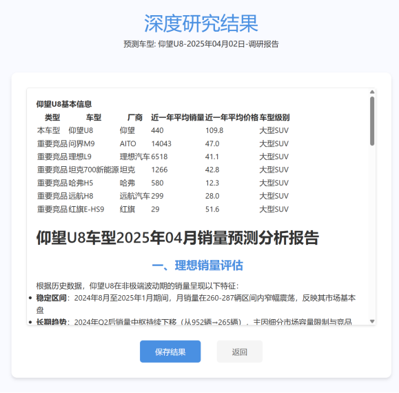

# 汽车销量智能预测与深度分析系统

## 项目概述

本项目是一款创新的汽车销量预测与分析平台，旨在解决传统预测模型的“黑箱”问题并有效应对市场突发事件对销量的影响。系统核心在于融合了神经网络（NN）的强大定量预测能力与大语言模型（LLM）的智能定性分析智慧，提供既准确又具备可解释性的销量预测结果和深度研究报告。

**核心理念：**  
定量预测提供基准，定性分析深化理解与量化影响，特别是针对突发事件。最终产出高度可信、有理有据的预测与分析报告。

---

## 项目痛点与解决方案

### 产品部门内部数据库因子挖掘水平低，导致传统预测模型的预测区间宽

产品部门的内部数据库的主要来源是爬虫爬取的公开市场数据，时间周期短、因子数量少，若仅使用MLP来预测，则80%置信度下的预测区间非常宽，不具有实战意义。

**解决方案：**  
基于MLP的预测结果，使用大语言模型进一步深入调查关注的车型，大幅缩减预测区间宽度，同时提高预测的命中率。

### 传统预测模型的“黑箱”问题

难以向业务部门解释预测结果的由来，导致采信度低。

**解决方案：**  
系统利用AI生成详细的“深度研究”报告，展现预测背后的推理过程、依据和分析框架，这一框架已通过业务部门验证，极大提升了透明度和可信度。

### 突发事件影响量化难题

市场波动、政策变化、竞品行动等突发因素难以在传统定量模型中准确体现和量化。

**解决方案：**  
系统引入大语言模型进行深度定性分析，能够识别、评估并尝试量化这些非结构化因素对销量的潜在影响，有效弥补了纯定量模型的不足。

### 繁重的人工研究工作

深入的市场和车型分析需要大量人工投入。

**解决方案：**  
系统自动生成高质量的AI深度研究报告，显著减轻了业务分析师和研究人员的工作负担。

### 传统的deep research无法交互式进行推理

传统的AI deep research只收集网络上公开信息进行调研与推理，但在公司内部，业务部门能够获得未公开的一手信息，只有将这些一手信息纳入推理中，才能进一步提高预测的精准度。

**解决方案：**  
该系统实现了在AI深度研究与推理的过程中，允许业务人员反馈一线信息、调整推理走向的功能，从而实现AI的交互式预测，该功能也将**预测不准确**的责任让渡给业务部而非留在产品部门。

---

## 核心功能与价值展示

系统主要分为**月度销量预测**和**年度销量预测**两大模块：

  
  

### 1. 月度销量预测模块

**目标：** 预测下一月的指定车型销量，并提供详细分析，**有效支持业务部库存优化**。

**主要交付：**

- **神经网络定量预测结果：** 提供初步的、基于历史数据的预测区间。  
    
  *图示：展示神经网络初步预测结果，突显其预测区间相对较宽。*

- **AI深度研究报告：** 针对指定车型，输出包含推理依据、过程和分析框架的详细报告，揭示销量背后的多维度影响因素。  
    
  *图示：展示AI生成的详细研究报告预览界面。*

- **AI报告修正界面：** 提供用户输入反馈意见修正AI报告的功能，确保报告的准确性和贴合性。  
    
   
   
  *图示：展示用户如何通过反馈框与AI互动修正报告。*

- **月度综合预测结果与报告：** 融合定量与定性分析，给出更精确的月度预测值，并附带解释性分析报告。
   
---

### 2. 年度销量预测模块

**目标：** 进行中长期的年度销量预测，并进行战略层面的情景分析与风险预警，**辅助筛选潜在战略合作伙伴**。

**主要交付：**

- **长期PEST分析报告：** （周期性产出）提供对宏观外部环境的粗颗粒度分析，更新AI对大环境的认知。  
    
  *图示：展示长期PEST分析报告的预览界面。*

- **年度AI深度研究报告：** 针对指定车型，产出覆盖面更广（PEST、企业、产品/竞品）的深度分析报告。  
    
  *图示：展示年度AI深度研究报告的预览界面。*

- **年度综合预测报告：** 给出未来n年的大致销量预测走向，更重要的是包含情景演绎和潜在重大事件的预警，辅助长期战略规划。  
    
  *图示：展示年度综合预测报告，重点突出趋势、情景分析和风险预警部分。*

---

## 项目价值总结

本项目通过有机结合神经网络的预测精度与大语言模型的分析智能，构建了一个强大、透明且实用的汽车销量预测与分析平台。它不仅提升了预测结果的准确性（短期高精度，长期与专家判断相近），更通过提供可解释的分析报告和有效应对突发事件的能力，极大地增强了业务部门对预测结果的信任度，并显著提升了市场研究的效率。**项目受部门高度重视，部门leader汇报成果至CEO。**

---

> **重要提示：**  
> 尽管系统结合了先进的AI技术，使用者仍需警惕AI分析中可能发生的谬误，建议结合自身经验进行审慎判断。